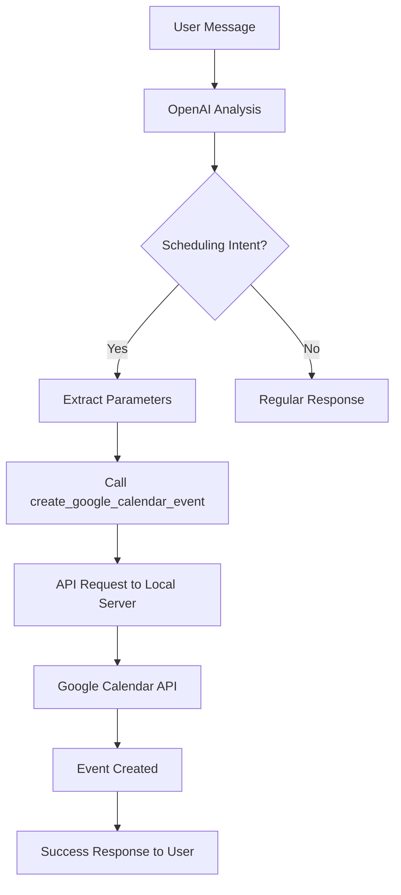

# 🤖 Google Calendar OpenAI Tool with Auto-Refresh

## 📋 Overview

This tool enables OpenAI (GPT) to automatically create Google Calendar events when users request to schedule appointments, meetings, classes, or any time-based events through natural language conversation. **Now with automatic token refresh** - no more manual re-authorization!

## 🔄 **NEW: Auto-Refresh Token System**

### ✨ Key Benefits:
- **🔧 Automatic Token Refresh**: Tokens refresh automatically when they expire (within 5 minutes)
- **💾 Persistent Storage**: Tokens stored securely in database with user metadata
- **🔄 Manual Refresh**: Endpoint to manually refresh tokens when needed
- **📊 Token Status**: Check token health and expiry without exposing sensitive data
- **🚫 No Re-Authorization**: Once authorized, tokens refresh automatically without user interaction

### 🆕 New Endpoints:

#### 1. **Auto-Refresh Event Creation** (`/events-with-auto-token`)
- Uses stored tokens with automatic refresh
- No need for Bearer token in header
- Handles token expiry automatically

#### 2. **Token Information** (`/token-info`)
- Check token status without exposing actual tokens
- See expiry dates and refresh token availability

#### 3. **Manual Token Refresh** (`/refresh-token`)
- Force refresh tokens manually
- Useful for debugging or ensuring fresh tokens

#### 4. **Store User Tokens** (`/store-tokens`)
- Initial token storage after OAuth flow
- Associates tokens with user email

## 🔧 How It Works

### 1. **Natural Language Detection**
OpenAI automatically detects when users want to schedule something:
- "Can you schedule a meeting for tomorrow at 3 PM?"
- "I need to book a class for next Monday"
- "Remind me about my appointment on Friday"
- "Create an event for the team meeting"

### 2. **Automatic Tool Selection**
The AI uses the `create_google_calendar_event` tool when it identifies scheduling intent.

### 3. **Smart Parameter Extraction**
- **Required:** Event title, start time, end time
- **Optional:** Description, location, attendees, timezone

## 🎯 Use Cases

### Quick Learning Scenarios:
- **Class Scheduling**: "Book my English class for next Tuesday 4-6 PM"
- **Exam Reminders**: "Set a reminder for my final exam on Friday"
- **Orientation Events**: "Schedule orientation for new students"

### General Business:
- **Client Meetings**: "Schedule a consultation with John tomorrow"
- **Team Events**: "Create a team standup for Monday morning"
- **Deadlines**: "Remind me about the project deadline"

## 📝 Tool Definition

```typescript
{
  name: "create_google_calendar_event",
  description: "Crea un evento en Google Calendar cuando el usuario solicite agendar, programar o crear una cita, reunión, evento o recordatorio.",
  parameters: {
    summary: "Título del evento (requerido)",
    startDateTime: "Fecha y hora de inicio (ISO 8601)",
    endDateTime: "Fecha y hora de fin (ISO 8601)", 
    description: "Descripción del evento (opcional)",
    location: "Ubicación (opcional)",
    attendeeEmails: "Lista de emails de invitados (opcional)",
    timeZone: "Zona horaria (por defecto Mexico/Ciudad)"
  }
}
```

## 🔗 Integration Flow



## ⚙️ Configuration

### Environment Variables:
```bash
# Default email for auto-token requests
GOOGLE_CALENDAR_DEFAULT_EMAIL=your-email@gmail.com

# Google OAuth credentials (already configured)
GOOGLE_CALENDAR_CLIENT_ID=your_client_id
GOOGLE_CALENDAR_CLIENT_SECRET=your_client_secret
GOOGLE_REDIRECT_URI=http://localhost:3001/auth/google/callback
```

### Prerequisites:
1. ✅ Google Calendar API enabled
2. ✅ OAuth credentials configured  
3. ✅ User authorized via `/auth/google/callback`
4. ✅ **NEW**: Tokens stored automatically in database with refresh capability

## 🔧 Setup Process (One-Time)

### Option A: Automatic Storage (Recommended)
```bash
# 1. Get auth URL
curl http://localhost:3001/api/google-calendar/auth-url

# 2. Complete OAuth flow in browser

# 3. Exchange code with email to auto-store tokens
curl -X POST http://localhost:3001/api/google-calendar/exchange-code \
  -H "Content-Type: application/json" \
  -d '{
    "code": "YOUR_AUTH_CODE",
    "email": "your-email@gmail.com"
  }'
```

### Option B: Manual Storage
```bash
# Store tokens manually (if you already have them)
curl -X POST http://localhost:3001/api/google-calendar/store-tokens \
  -H "Content-Type: application/json" \
  -d '{
    "email": "your-email@gmail.com",
    "access_token": "your_access_token",
    "refresh_token": "your_refresh_token",
    "expiry_date": 1234567890000
  }'
```

## 🔍 Token Management

### Check Token Status
```bash
curl "http://localhost:3001/api/google-calendar/token-info?email=your-email@gmail.com"
```

### Manual Token Refresh
```bash
curl -X POST http://localhost:3001/api/google-calendar/refresh-token \
  -H "Content-Type: application/json" \
  -d '{"email": "your-email@gmail.com"}'
```

### Test Auto-Refresh
```bash
# This will automatically refresh tokens if needed
curl -X POST http://localhost:3001/api/google-calendar/events-with-auto-token \
  -H "X-User-Email: your-email@gmail.com" \
  -H "Content-Type: application/json" \
  -d '{
    "summary": "Auto-Refresh Test",
    "startDateTime": "2024-07-25T14:00:00.000Z",
    "endDateTime": "2024-07-25T15:00:00.000Z"
  }'
```

## 🎨 Example Conversations

### Conversation 1: Simple Meeting
```
User: "I need to schedule a meeting with the team tomorrow at 10 AM for 2 hours"

AI: "¡Perfecto! Te ayudo a agendar esa reunión."
[Calls: create_google_calendar_event]

AI: "✅ ¡Evento creado exitosamente en Google Calendar!

📅 **Reunión con el equipo**
🕒 **Inicio:** 25 de julio de 2024, 10:00 AM
🕒 **Fin:** 25 de julio de 2024, 12:00 PM
🔗 **Link:** https://calendar.google.com/event?eid=..."
```

### Conversation 2: Class with Details
```
User: "Schedule my Quick Learning English class for next Monday 4-6 PM at the downtown campus"

AI: [Calls: create_google_calendar_event with location and description]

AI: "✅ ¡Clase agendada exitosamente!

📅 **Quick Learning - Clase de Inglés**
🕒 **Inicio:** 29 de julio de 2024, 4:00 PM  
🕒 **Fin:** 29 de julio de 2024, 6:00 PM
📍 **Ubicación:** Campus Centro
🔗 **Link:** https://calendar.google.com/..."
```

## 🛠️ Technical Implementation

### 1. **Tool Function** (`openaiTools.ts`)
```typescript
export const create_google_calendar_event = async (
  summary: string,
  startDateTime: string,
  endDateTime: string,
  // ... other parameters
): Promise<string> => {
  // Validation and API call logic
}
```

### 2. **API Integration**
- Makes HTTP POST to local Google Calendar API
- Uses auto-token authentication with default email
- Handles errors gracefully with user-friendly messages

### 3. **Error Handling**
- ✅ Date validation
- ✅ Authorization checks
- ✅ Network error handling
- ✅ User-friendly error messages

## 🚀 Deployment Notes

### For Production:
1. Update `GOOGLE_CALENDAR_DEFAULT_EMAIL` to production email
2. Ensure Google OAuth redirect URI includes production domain
3. Consider rate limiting for API calls
4. Add logging for audit trails

### For Development:
1. Complete OAuth flow first to get tokens stored
2. Test with various date formats and edge cases
3. Verify timezone handling for your region

## 🔍 Debugging

### Check if tool is working:
```bash
# 1. Verify server is running
curl http://localhost:3001/api/google-calendar/auth-url

# 2. Check stored tokens
curl "http://localhost:3001/api/google-calendar/my-token?email=your-email@gmail.com"

# 3. Test manual event creation
curl -X POST http://localhost:3001/api/google-calendar/events-with-auto-token \
  -H "X-User-Email: your-email@gmail.com" \
  -H "Content-Type: application/json" \
  -d '{
    "summary": "Test Event",
    "startDateTime": "2024-07-25T10:00:00.000Z",
    "endDateTime": "2024-07-25T11:00:00.000Z"
  }'
```

### Common Issues:
- **"No valid tokens found"**: Complete OAuth authorization first
- **"Invalid date format"**: Ensure ISO 8601 format (YYYY-MM-DDTHH:mm:ss.sssZ)
- **"Connection refused"**: Check if server is running on port 3001

## 🎉 Benefits

✅ **Natural Language**: Users can schedule in conversational language  
✅ **Automatic**: No manual calendar interaction needed  
✅ **Smart**: AI extracts date/time from context  
✅ **Integrated**: Works seamlessly with existing chat flows  
✅ **Reliable**: Proper error handling and validation  
✅ **Timezone Aware**: Handles Mexican timezone by default  

---

**Happy scheduling! 📅🤖**
